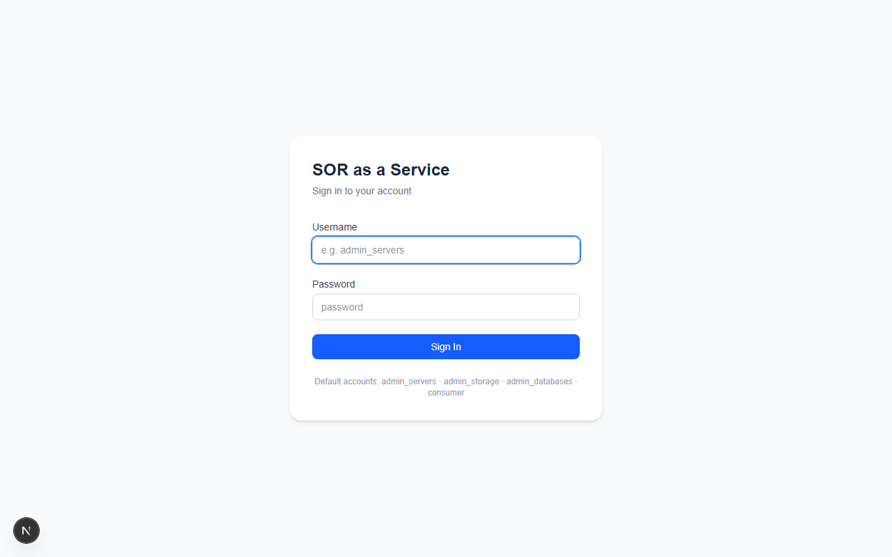
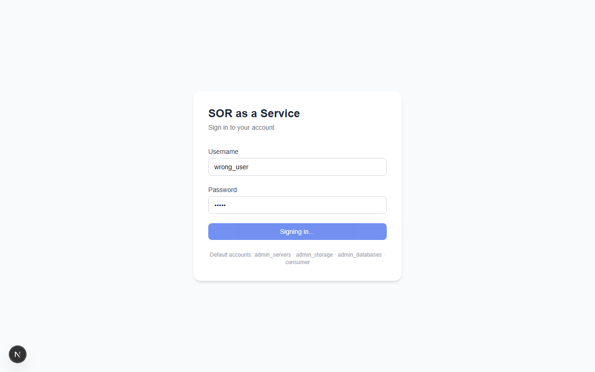
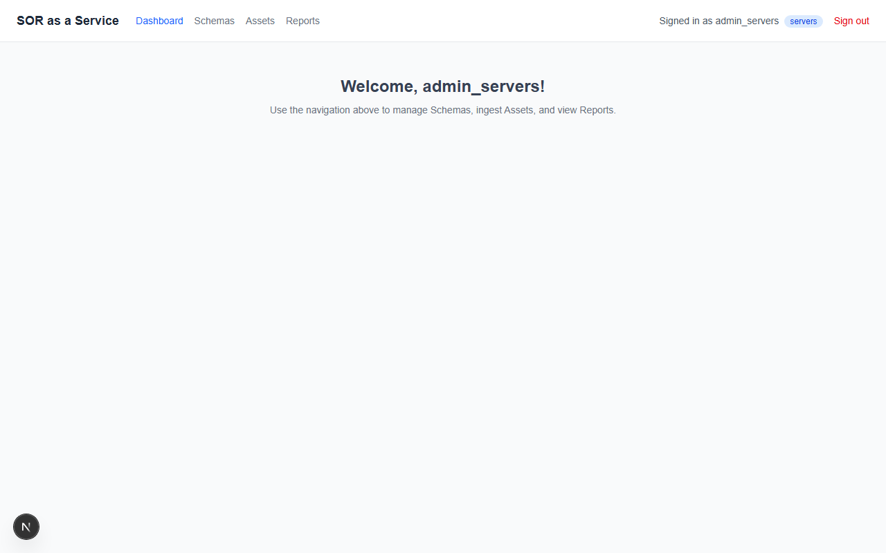
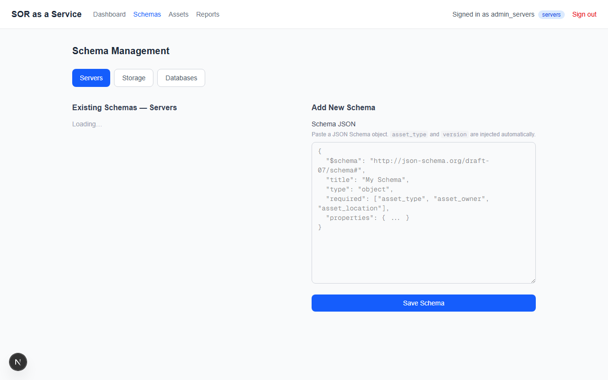
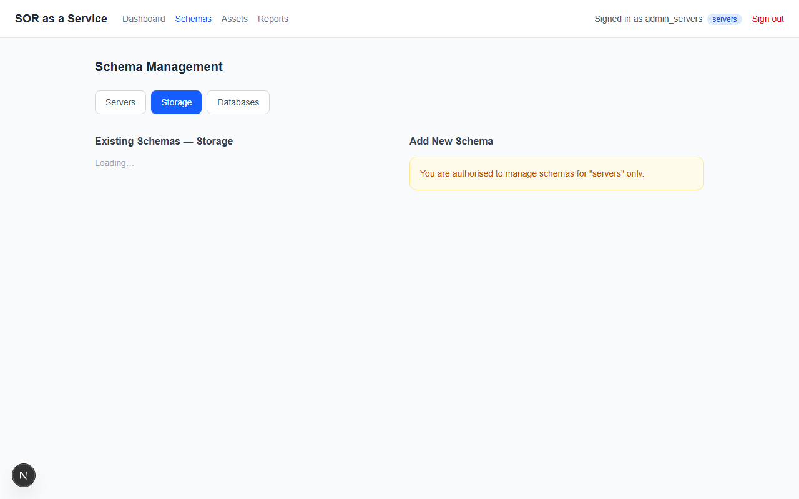
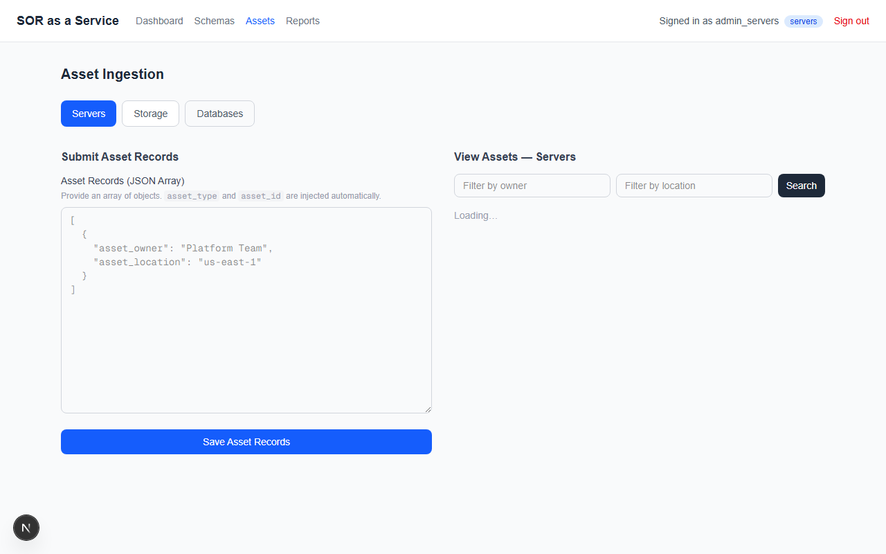
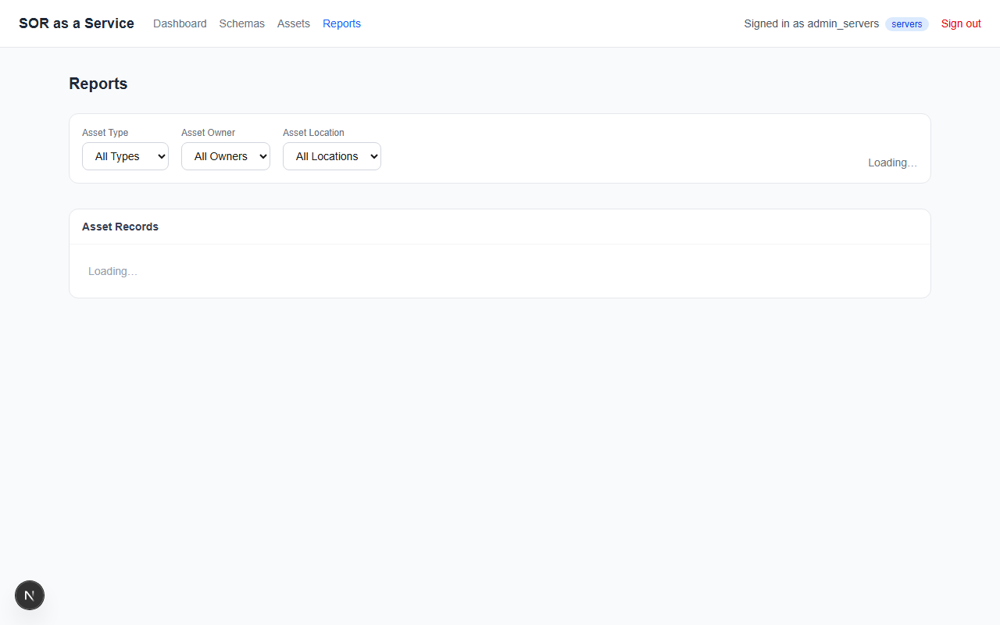
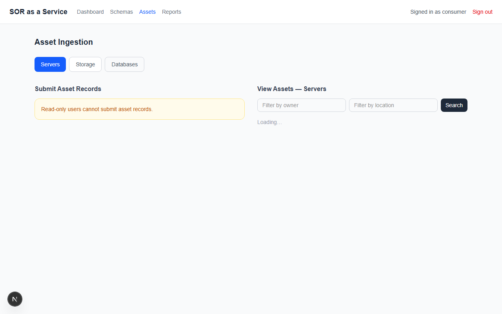

# SOR as a Service

A **System of Record (SOR)** web application for managing infrastructure assets — Servers, Storage, and Databases. Built with a Next.js frontend, Python FastAPI backend, and MongoDB Atlas database.

---

## Features

- **Role-based access control** — four user accounts (`admin_servers`, `admin_storage`, `admin_databases`, `consumer`) each scoped to their asset type
- **JSON Schema-driven validation** — define custom schemas per asset type; all ingestion is validated against the latest schema version
- **Bulk asset ingestion** — submit arrays of asset records with all-or-nothing transactional writes; system-generated unique asset IDs
- **Reporting & chart visualisation** — filter assets by type, owner, and location; bar charts show asset counts grouped by each dimension
- **Schema versioning** — schemas auto-increment major versions (`1.0 → 2.0 → 3.0`)

---

## Tech Stack

| Layer | Technology |
|---|---|
| Frontend | Next.js (React, TypeScript, Tailwind CSS) |
| Backend | Python FastAPI |
| Database | MongoDB Atlas |
| Charts | Recharts |

---

## Getting Started

### Prerequisites

- Python 3.10+
- Node.js 18+
- A MongoDB Atlas cluster (connection string in `.env`)

### 1. Configure environment

Create `.env` at the repo root:

```env
DATABASE_URL=mongodb+srv://<user>:<password>@<cluster>.mongodb.net/?appName=<app>
```

Create `frontend/.env.local`:

```env
NEXT_PUBLIC_API_URL=http://localhost:8000
```

### 2. Seed the database

```bash
cd backend
pip install -r requirements.txt
python seed.py          # creates default users
python seed_schemas.py  # creates default schemas for all three asset types
```

### 3. Run the backend

```bash
cd backend
uvicorn main:app --reload --port 8000
```

API docs are available at `http://localhost:8000/docs`.

### 4. Run the frontend

```bash
cd frontend
npm install
npm run dev
```

Open `http://localhost:3000` in your browser.

---

## Default Accounts

All accounts use the password `password`.

| Username | Role | Write access |
|---|---|---|
| `admin_servers` | Server admin | Schemas & assets for **servers** only |
| `admin_storage` | Storage admin | Schemas & assets for **storage** only |
| `admin_databases` | Database admin | Schemas & assets for **databases** only |
| `consumer` | Read-only | GET endpoints across all asset types |

---

## API Endpoints

| Method | Path | Description |
|---|---|---|
| `POST` | `/login` | Authenticate and retrieve user profile |
| `GET` | `/schemas/{asset_type}` | List schemas for an asset type |
| `POST` | `/schemas/{asset_type}` | Save a new schema (admin only) |
| `GET` | `/assets/{asset_type}` | List assets; optional `asset_owner` / `asset_location` filters |
| `POST` | `/assets/{asset_type}` | Bulk-ingest asset records (admin only) |

All schema/asset endpoints require an `X-Username` header.

---

## Screenshots

### Login



*The login page is the entry point for all four user roles. Default account names are shown as hints.*

---

### Login — Failed Authentication



*Invalid credentials trigger an inline error message without a page reload.*

---

### Dashboard



*After login, users land on the dashboard. The header shows the signed-in username and asset-type badge, plus navigation to Schemas, Assets, and Reports.*

---

### Schema Management — Admin View



*Admins can paste a JSON Schema document and save it. The system auto-injects `asset_type` and increments the `version`. Existing schemas for the selected asset type are listed on the left.*

---

### Schema Management — Cross-Type Restriction



*When `admin_servers` switches to the Storage tab, they can view storage schemas but the write form is replaced with an authorisation warning. Cross-type writes return HTTP 403.*

---

### Asset Ingestion



*Admins submit bulk asset records as a JSON array. The backend validates every record against the latest schema version in a single transaction — all records are saved or none are. Unique asset IDs (e.g., `SRV-<uuid>`) are returned on success.*

---

### Reports



*The Reports page lets any user filter assets by type, owner, and location. Bar charts visualise counts by asset type, owner, and location. A paginated table shows the matching records.*

---

### Consumer — Read-Only Access



*The `consumer` account can browse all asset types but sees a read-only notice wherever write operations would otherwise appear.*

---

## Project Structure

```
sor_as_a_service/
├── backend/
│   ├── main.py              # FastAPI app + CORS middleware
│   ├── auth.py              # X-Username header auth + RBAC helpers
│   ├── db.py                # Motor (async MongoDB) connection
│   ├── seed.py              # Seed default users
│   ├── seed_schemas.py      # Seed default schemas
│   ├── routers/
│   │   ├── login.py
│   │   ├── schemas.py
│   │   └── assets.py
│   ├── models/
│   │   ├── user.py
│   │   └── schema.py
│   └── requirements.txt
├── frontend/
│   ├── app/
│   │   ├── login/page.tsx
│   │   ├── dashboard/page.tsx
│   │   ├── schemas/page.tsx
│   │   ├── assets/page.tsx
│   │   └── reports/page.tsx
│   └── package.json
├── docs/
│   └── screenshots/
└── .env
```

## Key Business Rules

- **Asset IDs are system-wide unique** — generated as `<PREFIX>-<uuid>` and checked across all three asset collections before insertion.
- **Schema versioning uses major versions only** (`1.0`, `2.0`, `3.0` …). Saving a new schema always increments by 1.0 from the current maximum.
- **Validation uses the latest schema version** for each asset type.
- **All-or-nothing ingestion** — a batch of records is either fully saved or fully rejected; no partial writes.
